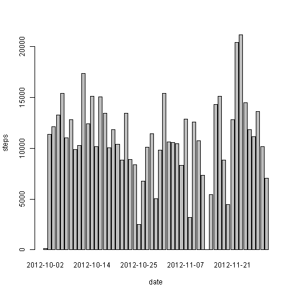
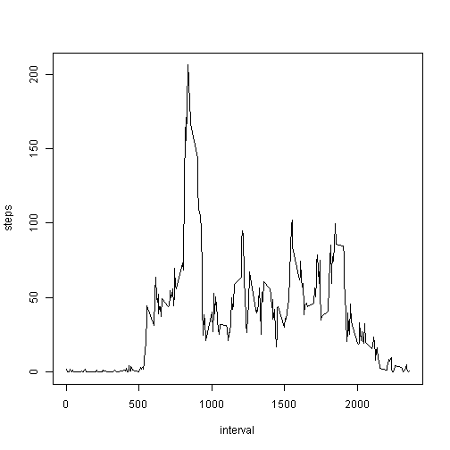
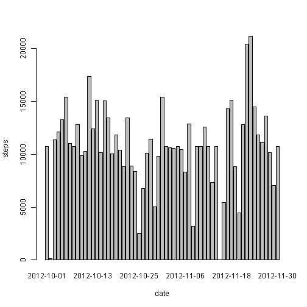
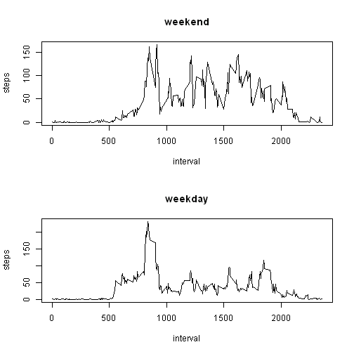

# Reproducible Research: Peer Assessment 1
===========================================
Created by Devendra Desale  
[Github Repo](https://github.com/DevendraDesale/RepData_PeerAssessment1)

## Loading and preprocessing the data
Step:  
1. Unzip the zip file to extract activity.csv  
2. Write summary of activity dataset.


```r
unzip("activity.zip")
activity <- read.csv("activity.csv")
summary(activity)
```

```
##      steps               date          interval   
##  Min.   :  0.0   2012-10-01:  288   Min.   :   0  
##  1st Qu.:  0.0   2012-10-02:  288   1st Qu.: 589  
##  Median :  0.0   2012-10-03:  288   Median :1178  
##  Mean   : 37.4   2012-10-04:  288   Mean   :1178  
##  3rd Qu.: 12.0   2012-10-05:  288   3rd Qu.:1766  
##  Max.   :806.0   2012-10-06:  288   Max.   :2355  
##  NA's   :2304    (Other)   :15840
```


## What is mean total number of steps taken per day?

Steps:  
1. Load the libraries  
2. Create a histogram of the total number of steps taken each day  
3. Calculate and report the **mean** and **median** total number of
steps taken per day.


```r
library(stats)

steps.date <- aggregate(steps ~ date, data=activity, FUN=sum)
barplot(steps.date$steps, names.arg=steps.date$date, xlab="date", ylab="steps")
```

 

```r
mean_steps <- round(mean(steps.date$steps),2)
median_steps <- round(median(steps.date$steps),2)
```
**For the total number of steps taken per day:**  
- **Mean: 10766.19**
- **Median: 10765**

## What is the average daily activity pattern?
Step:  
1. Make a time series plot (i.e. `type = "l"`) of the 5-minute
interval (x-axis) and the average number of steps taken, averaged
across all days (y-axis)  
2. Which 5-minute interval, on average across all the days in the
dataset, contains the maximum number of steps?  


```r
steps.interval <- aggregate(steps ~ interval, data=activity, FUN=mean)
plot(steps.interval, type="l")
```

 

```r
steps_interval <- steps.interval$interval[which.max(steps.interval$steps)]
```

The **835<sup>th</sup> interval** has the maximum activity for the steps.

## Imputing missing values
1. Calculate and report the total number of missing values in the
dataset (i.e. the total number of rows with `NA`s)

2. Devise a strategy for filling in all of the missing values in the
dataset. The strategy does not need to be sophisticated. For
example, you could use the mean/median for that day, or the mean
for that 5-minute interval, etc.
This program we will use means for the 5-minute intervals as fillers for missing
values.
3. Create a new dataset that is equal to the original dataset but with
the missing data filled in.
4. Make a histogram of the total number of steps taken each day and
Calculate and report the **mean** and **median** total number of
steps taken per day. Do these values differ from the estimates from
the first part of the assignment? What is the impact of imputing
missing data on the estimates of the total daily number of steps?


```r
sum(is.na(activity))
```

```
## [1] 2304
```

```r
activity <- merge(activity, steps.interval, by="interval", suffixes=c("",".y"))
nas <- is.na(activity$steps)
activity$steps[nas] <- activity$steps.y[nas]
activity <- activity[,c(1:3)]


steps.date <- aggregate(steps ~ date, data=activity, FUN=sum)
barplot(steps.date$steps, names.arg=steps.date$date, xlab="date", ylab="steps")
```

 

```r
mean_steps <- round(mean(steps.date$steps),2)
median_steps <- round(median(steps.date$steps),2)
```


**For the total number of steps taken per day with the imputing the missing values.:**  
- **Mean: 10766.19**
- **Median: 10766.19**  

Conclusion  
* The impact of the missing data seems rather low, at least when
estimating the total number of steps per day. 
* We observe that while the mean value remains unchanghed, the median value has shifted closer to the mean. 


## Are there differences in activity patterns between weekdays and weekends?
Steps:  
1. Create a new factor variable in the dataset with two levels --
"weekday" and "weekend" indicating whether a given date is a
weekday or weekend day.  

2. Make a panel plot containing a time series plot (i.e. `type = "l"`)
of the 5-minute interval (x-axis) and the average number of steps
taken, averaged across all weekday days or weekend days
(y-axis).


```r
daytype <- function(date) {
    if (weekdays(as.Date(date)) %in% c("Saturday", "Sunday")) {
        "weekend"
        } else {
            "weekday"
            }
    }
activity$daytype <- as.factor(sapply(activity$date, daytype))

par(mfrow=c(2,1))
for (type in c("weekend", "weekday")) {
    steps.type <- aggregate(steps ~ interval,
                            data=activity,
                            subset=activity$daytype==type,
                            FUN=mean)
    plot(steps.type, type="l", main=type)
    }
```

 

Conclusion  
We observe that activity on the **weekends** tends **to be more spread out over the day** compared to the **weekdays**. This could be due to the fact that activities on weekdays mostly follow a work related routine, whereas weekends tend to be more adhoc.
